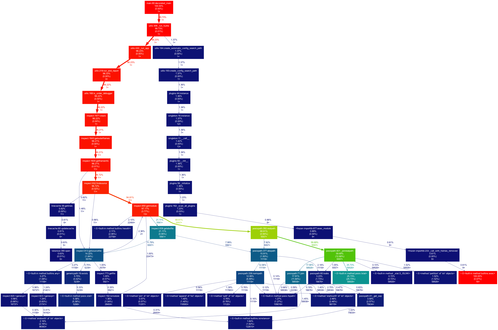

# PHASE 2: Enhancing ML Operations with Containerization & Monitoring

## 1. Containerization
- [ ] **1.1 Dockerfile**
  - [ ] A `Dockerfile` has been created and tested successfully
  - [ ] The container runs training script and outputs model artifact (`my_trained_model.pt`) to mounted host directory
  - [ ] Build and run instructions are documented in detail in main `README.md`
- [ ] **1.2 Environment Consistency**
  - [ ] All project dependencies (including Python packages from `requirements.txt`) are included in Docker image
  - [ ] The container ensures reproducible training environments across different machines!

## 2. Monitoring & Debugging

- [ ] **2.1 Debugging Practices**

  - [ ] Debugging tools used (e.g., pdb)
    - **pdb**: Python’s built-in interactive debugger, used for stepwise inspection during development.
    - **logger**: Python’s `logging` module was used to record detailed runtime events and metrics.
    - **psutil**: A system utility library to log real-time CPU and memory usage during training.

  
  
  - [ ] Example debugging scenarios and solutions
  - *Scenario 1: Input shape mismatch during model training*
      - **Issue:** When building the model, an error was raised due to a mismatch between the expected input shape and the padded sequence dimensions.
      - **Solution:** Inserted `pdb.set_trace()` before model construction to inspect `X_train_pad.shape` and adjusted the `maxlen` parameter accordingly.

  - *Scenario 2: Labels not being encoded properly*
    - **Issue:** Model training failed due to incorrectly shaped label arrays.
    - **Solution:** Used `pdb.set_trace()` to inspect `y_train_enc` right after `LabelEncoder` and `to_categorical` conversion.

  - *Scenario 3: Inconsistent token counts between train/test*
    - **Issue:** Vocabulary size and tokenizer mappings were inconsistent due to incorrect tokenizer usage across splits.
    - **Solution:** Logged `len(tokenizer.word_index)` and verified consistency with logger output.

  - *Logger usage for passive debugging:*
    - Informative logs were inserted using `logger.info(...)` at key points such as data loading, preprocessing, model training, evaluation, and saving artifacts.
    - These logs helped trace the full pipeline execution without pausing execution flow.

  - **Sample Resource Logs:**
    The following logs were recorded during different stages of model training using `psutil` and `logger`:

    ```
    [2025-05-22 09:07:17,775][__main__][INFO] - [Resource @ before_model_build] CPU Usage: 15.20%, Memory Usage: 78.30%
    [2025-05-22 09:42:10,587][__main__][INFO] - [Resource @ after_training] CPU Usage: 16.20%, Memory Usage: 77.60%
    [2025-05-22 09:42:23,178][__main__][INFO] - [Resource @ after_evaluation] CPU Usage: 17.80%, Memory Usage: 76.70%
    ```
    These logs provide insights into the system resource footprint during model training and aid in identifying performance bottlenecks.

## 3. Profiling & Optimization
- [ ] **3.1 Profiling Scripts**
  - [ ] cProfile, PyTorch Profiler, or similar used
    We used Python’s built-in `cProfile` module to analyze performance bottlenecks in our training pipeline.

    A profiling wrapper was added around the LSTM training function (`train_with_cfg`) in a separate script `profile_train.py`:
    ```python
    import cProfile
    import pstats

    from fake_news_detection.train_model import train_with_cfg
    from omegaconf import OmegaConf

    cfg = OmegaConf.load("config.yaml")

    cProfile.runctx("train_with_cfg(cfg)", globals(), locals(), "reports/figures/train_profile.prof")
    ```
    The output profiling file was saved to reports/figures/train_profile.prof and later visualized using gprof2dot and graphviz:
    ```
    gprof2dot -f pstats reports/figures/train_profile.prof | dot -Tpng -o reports/figures/train_profile.png
    ```
    

  - [ ] Profiling results and optimizations documented
  The profiling output shows that the majority of the execution time is spent inside the Keras `model.fit()` call, which is expected since model training is computationally intensive. Minor overhead was observed in text preprocessing, particularly in the `WordNetLemmatizer` from NLTK and regular expression-based token cleaning.

    **Optimization Steps Considered:**
    - Replaced nested loops in preprocessing with list comprehensions.
    - Limited `lemmatization` to a filtered subset of tokens to reduce redundant calls.
    - Disabled plotting during training-time profiling to reduce visualization overhead.

    These optimizations did not dramatically change the training time (as `model.fit()` remains the dominant factor), but they helped reduce preprocessing latency and clarified the true bottleneck lies within model training.

## 4. Experiment Management & Tracking
- [ ] **4.1 Experiment Tracking Tools**
  - [ ] MLflow, Weights & Biases, or similar integrated
  We integrated [MLflow](https://mlflow.org/) as our primary experiment tracking tool to log training parameters, evaluation metrics, model artifacts, and system resource usage.

    In `train_model.py`, MLflow is initialized using:
    ```python
    mlflow.set_experiment("fake-news")
    with mlflow.start_run():
    monitor_resources("before_model_build")

    model = build_lstm_model(
        vocab_size=vocab_size,
        maxlen=cfg.train.maxlen,
        embed_dim=cfg.train.embed_dim,
        lstm_units=cfg.train.lstm_units,
        dropout_rate=cfg.train.dropout,
        learning_rate=cfg.train.learning_rate,
    )

    # pdb.set_trace()  # DEBUG: inspect model summary and input tensors

    for key, value in cfg.train.items():
        mlflow.log_param(key, value)
    mlflow.set_tag("model_type", "LSTM")
    mlflow.set_tag("framework", "TensorFlow")
    ```

  - [ ] Logging of metrics, parameters, and models
  
  We used MLflow to systematically log the following information during training:

    - **Parameters**: 
      - `embedding_dim`: dimensionality of the word embeddings
      - `lstm_units`: number of LSTM units
      - `dropout`: dropout rate
      - `learning_rate`: learning rate for optimizer
      - `maxlen`: maximum sequence length
      - `epochs`: total training epochs

    - **Metrics**: 
      - `test_accuracy`, `test_loss`, `test_precision`, `test_recall`, `test_f1_score`
      - CPU and memory usage at different pipeline stages, e.g., `before_model_build_cpu_usage`

    - **Artifacts**: 
      - Trained LSTM model (`lstm_model.h5`)
      - Tokenizer object (`tokenizer.pkl`)
      - Training/validation loss and accuracy plots (`accuracy.png`, `loss.png`)
      - Confusion matrix visualization (`train_confusion_matrix.png`)
      - cProfile performance graph (`train_profile.png`)

  - [ ] Instructions for visualizing and comparing runs
    MLflow’s UI allows us to compare different runs and view training curves, metrics, and parameter configurations.

    To launch the MLflow tracking UI:
    ```
    mlflow ui
    ```

    This will start a local server (default at `http://127.0.0.1:5000`) where all training runs can be viewed and compared interactively. Each run can be expanded to inspect logged values and download associated artifacts like the model file and plots.

## 5. Application & Experiment Logging
- [ ] **5.1 Logging Setup**
  - [ ] logger and/or rich integrated
      We used Python’s built-in `logging` module to provide structured and timestamped log output throughout the training pipeline. All key stages—including data loading, model building, training, evaluation, and resource monitoring—are accompanied by `logger.info` messages for traceability. The logger is configured with a unified format showing time, level, and message:
        ```python
        logging.basicConfig(
            level=logging.INFO,
            format="%(asctime)s [%(levelname)s] %(message)s",
            handlers=[logging.StreamHandler()]
        )
        ```
        
  - [ ] Example log entries and their meaning
  Below are examples of log messages and what they indicate:
    
    - `[INFO] MLflow experiment set to 'fake-news'`  
      → Confirms that MLflow has successfully initialized and is tracking this run.

    - `[INFO] Building LSTM model...`  
      → Indicates the beginning of the model construction phase.

    - `[INFO] Test Accuracy: 0.9861`  
      → Shows the final test accuracy metric from evaluation.

    - `[INFO] [Resource @ after_training] CPU Usage: 32.10%, Memory Usage: 72.30%`  
      → Reports system resource usage at a specific training phase.

    These logs help in tracking model behavior, resource usage, and overall reproducibility during experiment runs.

## 6. Configuration Management
- [ ] **6.1 Hydra or Similar**
  - [ ] Configuration files created
    We used **Hydra** for managing hyperparameters and configuration files in a modular and flexible way. The main configuration file `config.yaml` is located at the project root and contains the training parameters:
    ```yaml
    train:
      maxlen: 150
      embed_dim: 100
      lstm_units: 150
      dropout: 0.5
      learning_rate: 0.0001
    ```

    The training script is decorated with Hydra's `@hydra.main()` to automatically load this config:
    ```python
    @hydra.main(config_path="../", config_name="config")
    def train(cfg: DictConfig):
        ...
    ```

  - [ ] Example of running experiments with different configs
  We support configuration overrides via `make` commands. For example, to override `dropout` and `lstm_units` during training:

    ```bash
    make train_model ARGS="train.dropout=0.3 train.lstm_units=256"
    ```

    The `Makefile` is designed to accept and pass these arguments to the Python script using `PYTHONPATH=. python fake_news_detection/train_model.py $(ARGS)`.

    This allows dynamic experimentation while maintaining reproducibility and consistent output handling via Hydra.


## 7. Documentation & Repository Updates
- [ ] **7.1 Updated README**
  - [ ] Instructions for all new tools and processes
  - [ ] All scripts and configs included in repo

---
