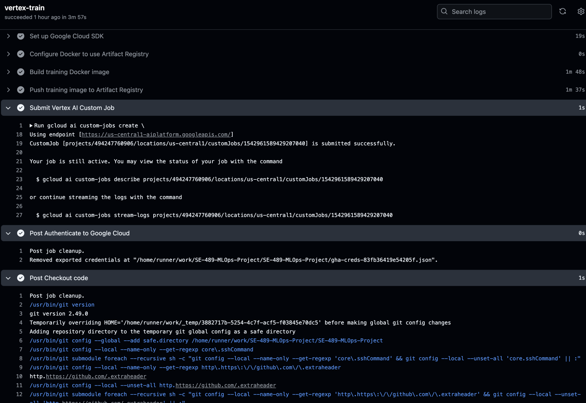
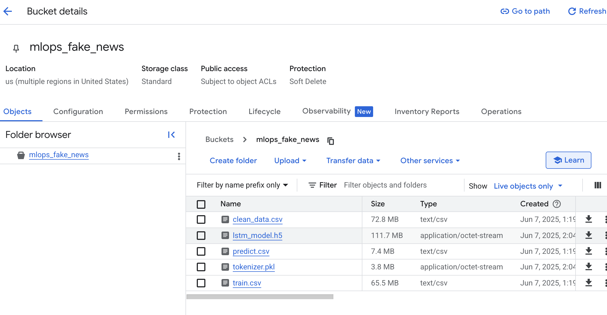

# PHASE 3: Continuous Machine Learning (CML) & Deployment

## 1. Continuous Integration & Testing
- [ ] **1.1 Unit Testing with pytest**
  - [ ] Test scripts for data processing, model training, and evaluation
  - [ ] Documentation of the testing process and example test cases
- [ ] **1.2 GitHub Actions Workflows**
  - [ ] CI workflows for running tests, DVC, code checks (e.g., ruff), Docker builds
  - Created two GitHub Actions workflows: `ci.yml` for code checks and testing, and `deploy.yml` for automated deployment.

  - [ ] Workflow YAML files included
  -  `ci.yml` is triggered on every push or pull request to the `main` branch. It includes:
  - Running code format checks using `ruff` and `black`
  - Type checking with `mypy`
  - Placeholder for `pytest` testing (test files scaffolded, tests to be added in later steps)
  -  `deploy.yml` builds the Docker image, downloads model artifacts from GitHub Releases, pushes the image to GCP Artifact Registry, and deploys the service to Cloud Run.

- [ ] **1.3 Pre-commit Hooks**
  - [ ] Pre-commit config and setup instructions
  -  -  Configured `.pre-commit-config.yaml` with the following hooks:
    - `trailing-whitespace`
    - `end-of-file-fixer`
    - `check-yaml`
    - `black`
    - `ruff`
    - `mypy`
  -  Installed pre-commit locally and verified the hooks trigger on each commit to ensure consistent code quality.
  -  ```pre-commit run --all-files```


## 2. Continuous Docker Building & CML
- [ ] **2.1 Docker Image Automation**
  - [ ] Automated Docker builds and pushes (GitHub Actions)
  - Wrote a custom `fastapi_app.dockerfile` that:
  - Uses `python:3.11-slim` as the base image
  - Installs dependencies from `requirements.txt`
  - Copies FastAPI application code
  - Downloads `lstm_model.h5` and `tokenizer.pkl` from the GitHub release using `wget` into the `/app/models` directory
  - [ ] Dockerfile and build/push instructions for Docker Hub and GCP Artifact Registry
  - Automated Docker image builds and pushes to:
    - `us-central1-docker.pkg.dev/fake-news-api-project/fastapi-repo/fastapi-api`
  -  This process is fully integrated into the `deploy.yml` workflow and triggered by commits to the `main` branch.

- [ ] **2.2 Continuous Machine Learning (CML)**
  - [ ] CML integration for automated model training on PRs
  - [ ] Example CML outputs (metrics, visualizations)
  - [ ] Setup and usage documentation

## 3. Deployment on Google Cloud Platform (GCP)
- [ ] **3.1 GCP Artifact Registry**
  - [ ] Steps for creating and pushing Docker images to GCP
  -  Created and configured Artifact Registry in the `fake-news-api-project` on GCP.
  -  Used `google-github-actions/setup-gcloud` in GitHub Actions with a service account stored in `GCP_SA_KEY` secret.
  -  Successfully pushed Docker image to `fastapi-repo` in `us-central1`.
- [ ] **3.2 Custom Training Job on GCP**
  - [ ] Vertex AI/Compute Engine job setup and documentation
  -  Implemented training logic in `train_model.py` and containerized it using `dockerfiles/train_model.dockerfile`.
  -  Built and pushed the training image to Artifact Registry:
     ```bash
     us-central1-docker.pkg.dev/fake-news-api-project/trainer-repo/train-job
     ```
     -  Submitted the training job via GitHub Actions using `gcloud ai custom-jobs create`:
    ```bash
        gcloud ai custom-jobs create \
          --region=us-central1 \
          --display-name=vertex-lstm-train \
          --worker-pool-spec=machine-type=n1-standard-4,replica-count=1,container-image-uri=us-central1-docker.pkg.dev/fake-news-api-project/trainer-repo/train-job
    ```
    Job submission is automated via .github/workflows/train-vertexai.yml, which supports manual triggering through workflow_dispatch.
      

  - [ ] Data storage in GCP bucket
  - Training data train.csv is stored in GCS at:
   https://storage.googleapis.com/mlops_fake_news/clean.csv
  - Model artifacts (lstm_model.h5, tokenizer.pkl) are saved back to the same bucket using gcsfs:
  ```python
    fs.put("/tmp/lstm_model.h5", "gs://mlops_fake_news/lstm_model.h5")
    fs.put("/tmp/tokenizer.pkl", "gs://mlops_fake_news/tokenizer.pkl")
  ```
  Public read access is enabled on the bucket to support model downloading from Cloud Run.
  


- [ ] **3.3 Deploying API with FastAPI & GCP Cloud Functions**
  - [ ] FastAPI app for model predictions
    - Created `/predict` POST endpoint in `main.py` using FastAPI.
    - Loads `lstm_model.h5` and `tokenizer.pkl` from `models/` directory.
    - Returns prediction result as JSON.
  - [ ] Deployment steps and API testing instructions
    - Dockerized app with `Dockerfile` using `uvicorn` server.
    - Built and tested image locally.
    - Pushed Docker image to GCP Artifact Registry.
    - Deployed container to GCP Cloud Run:
      ```bash
      gcloud run deploy fastapi-service \
        --image us-central1-docker.pkg.dev/[PROJECT_ID]/fastapi-repo/fastapi-api \
        --platform managed --region us-central1 --allow-unauthenticated
      ```
    - Verified API with `curl` by sending POST requests to `/predict`.

- [ ] **3.4 Dockerize & Deploy Model with GCP Cloud Run**
  - [ ] Containerization and deployment steps
    - Wrote `Dockerfile` using `python:3.11-slim` as base image.
    - Installed dependencies from `requirements.txt`.
    - Copied `fake_news_detection/` and `models/` (includes `lstm_model.h5` and `tokenizer.pkl`).
    - Exposed port `8080`, launched app using `uvicorn`.
    - Created GitHub Actions workflow `deploy-to-cloudrun.yml`:
      - Builds Docker image.
      - Pushes to Artifact Registry: `us-central1-docker.pkg.dev/fake-news-api-project/fastapi-repo/fastapi-api`.
      - Deploys to Cloud Run using `gcloud run deploy`.
  - [ ] Testing and result documentation
  - Verified deployment via the public Cloud Run endpoint.
    - Sent POST request to `/predict` with example input:
      ```bash
      curl -X POST https://fastapi-service-494247760906.us-central1.run.app/predict \
       -H "Content-Type: application/json" \
       -d '{"text": "This news is absolutely fake!"}'
      ```
    - Received valid prediction response `{ "prediction": 0.9986182451248169 }`.
    - Screenshots of successful deployment and API test included in documentation.
- [ ] **3.5 Interactive UI Deployment**
  - [ ] Streamlit or Gradio app for model demonstration
  - [ ] Deployment on Hugging Face platform
  - [ ] Integration of UI deployment into GitHub Actions workflow
  - [ ] Screenshots and usage examples

## 4. Documentation & Repository Updates
- [ ] **4.1 Comprehensive README**
  - [ ] Setup, usage, and documentation for all CI/CD, CML, and deployment steps
  - [ ] Screenshots and results of deployments
- [ ] **4.2 Resource Cleanup Reminder**
  - [ ] Checklist for removing GCP resources to avoid charges

---

> **Checklist:** Use this as a guide for documenting your Phase 3 deliverables. Focus on automation, deployment, and clear, reproducible instructions for all steps.
