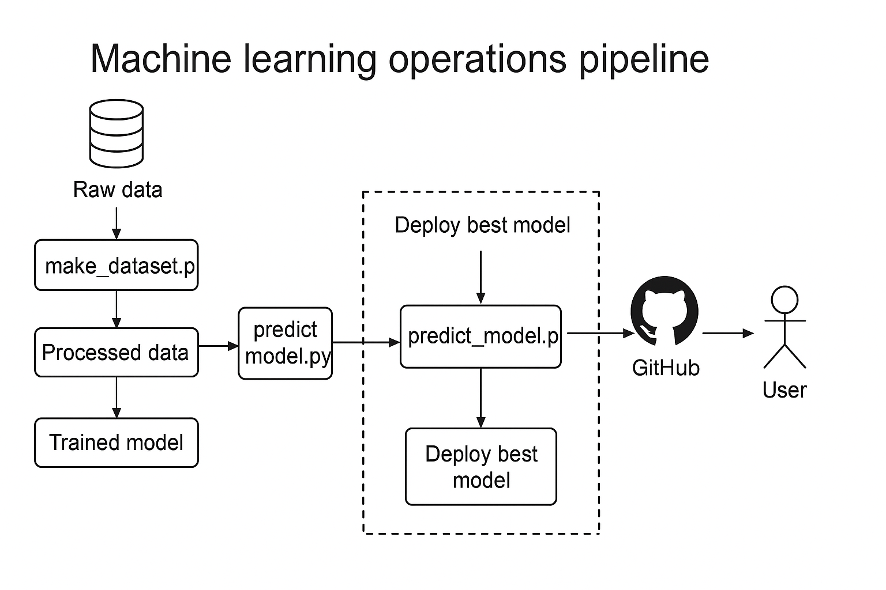

# Fake vs Real News Detection

A machine learning project for detecting fake and real news articles.

## 1. Team Information
- [ ] Team Name: *The* Team
- [ ] Team Members (Name & Email): Shereen Fahrai (sfahrai@depaul.edu) and Liangcai Xie (lxie9@depaul.edu)
- [ ] Course & Section: SE 489 ML Engineering for Production (MLOps), Sections 910 and 930

## 2. Project Overview
- [ ] Brief summary of the project (2-3 sentences): This project builds a machine learning pipeline to detect fake versus real news articles. In order to ensure reproducibility and scalability, we use an LSTM‑based natural language processing model, integrated within an MLOps framework. 
- [ ] Problem statement and motivation: The spread of misinformation online can have very serious social, political, and economic consequences. To address this, automating the accurate detection of fake news can help platforms and end users filter unreliable content and make better informed decisions.  
- [ ] Main objectives:
    - Develop a text‑classification model to distinguish fake news from real news with high accuracy.  
    - Establish a reproducible, version‑controlled MLOps pipeline (data, experiment tracking, and deployment).  
    - Integrate third‑party tools (such as MLflow) for experiment tracking and model management.  
    - Evaluate the model using accuracy, precision, recall, and F1-score.
    - Prepare for a user‑friendly GUI interface in later phases.


## 3. Project Architecture Diagram


## 4. Phase Deliverables
- [ ] [PHASE1.md](./PHASE1.md): Project Design & Model Development
- [ ] [PHASE2.md](./PHASE2.md): Enhancing ML Operations
- [ ] [PHASE3.md](./PHASE3.md): Continuous ML & Deployment

## 5. Setup Instructions
- [ ] How to set up the environment (conda/pip, requirements.txt, Docker, etc.): 

    ### Prerequisites

    Before proceeding, make sure you have the following installed:
    - Python 3.11
    - Anaconda or Miniconda
    - Make

    ### Create and Activate Environment
    ```
        make create_environment
        make activate_environment
    ```
    ### Install Dependencies
    ```    
        make dev_requirements
    ```
- [ ] How to run the code and reproduce results
    ### Run Data Processing Pipeline
    ``` 
        make data
    ```
    ### Run Baseline Model
    ``` 
        make baseline_model
    ```
    ### Train Model (LSTM)
    ``` 
        make train_model
    ```
    ### Run Predictions
    ``` 
        make predict_model
    ```
    ### Check Code Quality
    ```
        make lint
        make typecheck
        make format
        make fix
    ```

## 6. Contribution Summary
- [ ] Briefly describe each team member's contributions:
    - Shereen Fahrai: Led data ingestion and preprocessing for Phase 1. Implemented `make_dataset.py` to automate merging, labeling, text cleaning, and stratified splitting of raw data. Set up the data pipeline outputs (`clean_data.csv`, `train.csv`, `predict.csv`). Maintained the `Makefile` with reproducible CLI commands. Contributed to documentation in `README.md` and `PHASE1.md`.
    - Liangcai Xie: Led model development and environment setup. Refactored the baseline LSTM into a PyTorch module, built `train_model.py` for training, logging, and model saving. Integrated MLflow for experiment tracking, and authored `visualize.py` for plotting training results and created the architecture diagram. Contributed to documentation across PHASE1.md and the README.


## 7. References
- [ ] List of datasets, frameworks, and major third-party tools used:
    - Dataset: https://www.kaggle.com/datasets/clmentbisaillon/fake-and-real-news-dataset?resource=download
    - Baseline model code adapted from: https://www.kaggle.com/code/yossefmohammed/true-and-fake-news-lstm-accuracy-97-90/notebook
    - Tools: TensorFlow, Keras, NLTK, MLflow, Ruff, Mypy


## Project structure

The directory structure of the project looks like this:

```txt

├── Makefile             <- Makefile with convenience commands like `make data` or `make train`
├── README.md            <- The top-level README for developers using this project.
├── data
│   ├── processed        <- The final, canonical data sets for modeling.
│   └── raw              <- The original, immutable data dump.
│
├── docs                 <- Documentation folder
│   │
│   ├── index.md         <- Homepage for your documentation
│   │
│   ├── mkdocs.yml       <- Configuration file for mkdocs
│   │
│   └── source/          <- Source directory for documentation files
│
├── models               <- Trained and serialized models, model predictions, or model summaries
│
├── notebooks            <- Jupyter notebooks.
│
├── pyproject.toml       <- Project configuration file
│
├── reports              <- Generated analysis as HTML, PDF, LaTeX, etc.
│   └── figures          <- Generated graphics and figures to be used in reporting
│
├── requirements.txt     <- The requirements file for reproducing the analysis environment
|
├── requirements_dev.txt <- The requirements file for reproducing the analysis environment
│
├── tests                <- Test files
│
├── fake_news_detection  <- Source code for use in this project.
│   │
│   ├── __init__.py      <- Makes folder a Python module
│   │
│   ├── data             <- Scripts to download or generate data
│   │   ├── __init__.py
│   │   └── make_dataset.py
│   │
│   ├── models           <- model implementations, training script and prediction script
│   │   ├── __init__.py
│   │   ├── model.py
│   │
│   ├── visualization    <- Scripts to create exploratory and results oriented visualizations
│   │   ├── __init__.py
│   │   └── visualize.py
│   ├── train_model.py   <- script for training the model
│   └── predict_model.py <- script for predicting from a model
│
└── LICENSE              <- Open-source license if one is chosen
```

Created using [cookiecutter template](https://github.com/cookiecutter/cookiecutter) for getting
started with Machine Learning Operations (MLOps).
